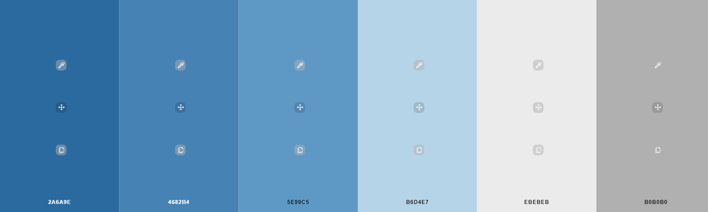

# [Portfolio John Morgan](https://johnny-morgan.github.io/portfolio/)

## User Experience (UX)

* ### User Stories

    1. As a new visitor to the website, I want to be able to easily navigate throughout the website to find content.
    2. As a new visitor to the website, I want to easily understand the main purpose of the site and learn more about the site owner.
    3. As a new visitor to the website, I want to be able to view the site owners portfolio of work.
    4. As a new visitor to the website, I want to be able to view and download the site owners CV.
    5. As a new visitor to the website, I want to be able to obtain the site owners contact details and/or send them a messsage through the website.
    6. As a new visitor to the website, I want to locate the site owners social media links as well as their GitHub and LinkedIn pages.

* ### Wireframes

    * The wireframes for this project can be found [here](https://github.com/Johnny-Morgan/portfolio/tree/master/assets/docs).

* ### Color Scheme

    I used a blue steel color scheme for this project which I obtained from [schemecolor](https://www.schemecolor.com/blue-steel-color-scheme.php#download). 

    

## Technologies Used

### Languages Used

* [HTML5](https://en.wikipedia.org/wiki/HTML5)

* [CSS3](https://en.wikipedia.org/wiki/Cascading_Style_Sheets)

### Frameworks, Libraries & Programs Used

* [Bootstrap 4.5](https://getbootstrap.com/)

    * Bootstrap was used to assist with the responsiveness and styling of the website.

* [GitPod](https://gitpod.io)

    * GitPod was used ad the IDE for this project.

* [Git](https://git-scm.com/) 

    * Git was used for version control by utilizing the Gitpod terminal to commit to Git and Push to GitHub.

* [GitHub](https://github.com/)

    * GitHub is used to store the projects code after being pushed from Git.

* [Balsamiq](https://github.com/)

    * Balsamiq was used to create the wireframes during the design process.

* [Google Fonts](https://fonts.google.com/)

    * Google Fonts was used to obtain the Roboto Condensed font family.

* [Font Awesome](https://fontawesome.com/)

    * Font Awesome was used to obtain the icons used in the Contact Me section.

## Credits

### Photos

* The background photo for the home section was taken from [StockSnap](https://pixabay.com/photos/guy-man-working-laptop-computer-2618928/) on pixabay.com.

### Code

* The CSS code for the contact form was taken from the YouTube channel [Web dev](https://www.youtube.com/watch?v=s6rF1Josk9M&ab_channel=Webdev) and edited.