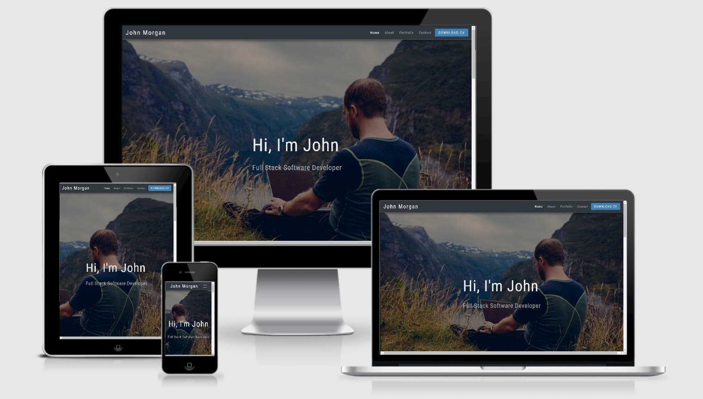

# [Portfolio John Morgan](https://johnny-morgan.github.io/portfolio/)

This website is my own (John Morgan) personal portfolio website. It designed to allow recruiters and hiring managers learn about
myself and to showcase my software skills. It does this by allowing potential employers to download my CV and view some of my projects.
It also provides users an option to contact me and connect via social media and LinkedIn.

The business goals of this website are:

- Build an online presence for myself.
- Showcase my software skills.
- Allow recruiters/employers to review my background and skills by providing a downloadable CV.
- Build relationships with recruiters/employers by providing contact details and social media links.

The customer goals of this website are:

- Learn about the site owners background and skills.
- View projects that the site owner has worked on.
- Have a convenient way of contacting the site owner.
- Easy navigation by providing a fixed navigation bar.

## User Experience (UX)

- ### User Stories

  - As a new visitor

    1. I want to be able to easily navigate throughout the website to find content.
    2. I want to easily understand the main purpose of the site and learn more about the site owner.
    3. I want to be able to view the site owners portfolio of work.
    4. I want to be able to view and download the site owners CV.
    5. I want to be able to obtain the site owners contact details and/or send them a messsage through the website.
    6. I want to locate the site owners social media links as well as their GitHub and LinkedIn pages.

  - As the site owner
    1. I want to showcase my skills by allowing vistiors to easily see my work.
    2. I want visitors to be able to contact me easily.

- ### Wireframes

  - The wireframes for this project can be found [here](https://github.com/Johnny-Morgan/portfolio/tree/master/assets/docs).

- ### Design

  - #### Colour Scheme

    I used a blue steel colour scheme for this project which I obtained from [schemecolor](https://www.schemecolor.com/blue-steel-color-scheme.php#download).

    

  - #### Typography

    The Roboto Condensed font is the main font used throughout the whole website with Sans Serif as the fallback font.
    Roboto Condensed has a mechanical skeleton and the forms are largely geometric but the font also features friendly and open curves.

  - #### Imagery

    The large background hero image was chosen as it represents the passions of the site owner, namley coding and the outdoors.

## Technologies Used

### Languages Used

- [HTML5](https://en.wikipedia.org/wiki/HTML5)

- [CSS3](https://en.wikipedia.org/wiki/Cascading_Style_Sheets)

### Frameworks, Libraries & Programs Used

- [Bootstrap 4.5](https://getbootstrap.com/)

  - Bootstrap was used to assist with the responsiveness and styling of the website.

- [GitPod](https://gitpod.io)

  - GitPod was used ad the IDE for this project.

- [Git](https://git-scm.com/)

  - Git was used for version control by utilizing the Gitpod terminal to commit to Git and Push to GitHub.

- [GitHub](https://github.com/)

  - GitHub is used to store the projects code after being pushed from Git.

- [Balsamiq](https://github.com/)

  - Balsamiq was used to create the wireframes during the design process.

- [Google Fonts](https://fonts.google.com/)

  - Google Fonts was used to obtain the Roboto Condensed font family.

- [Font Awesome](https://fontawesome.com/)

  - Font Awesome was used to obtain the icons used in the Contact Me section.

- [Autoprefixer](https://autoprefixer.github.io/)

  - Autoprefixer was used to add vendor prefixes.

## Testing

The [W3C Markup Validator](https://validator.w3.org/#validate_by_input) service was used to validate the HTML code of the project.
The results were that no errors or warnings were found.

The [W3C CSS Validator](https://jigsaw.w3.org/css-validator/#validate_by_input) service was used to validate the CSS code. No errors were found.

### Testing User Stories from User Experience (UX) Section

- As a new visitor to the website, I want to be able to easily navigate throughout the website to find content. Clicking on a link redirects the visitor to that section of the website.

  1.  The website consists of a single page. There is a clean navigation bar where each link describes where the user will be redirected to.

- As a new visitor to the website, I want to easily understand the main purpose of the site and learn more about the site owner.

  1. The home section clearly states that the site owner is a full stack software developer. Scrolling down the visitor can find more information about the owner
     such as that they are seeking a role as a junior software developer.

  2. There is also information here about their current situation and their hobbies. There are two call to action buttons
     directing the visitor to the owners GitHub page and a downloadable CV.

- As a new visitor to the website, I want to be able to view the site owners portfolio of work.

  1. The navigation bar contains a portfolio menu item which when clicked directs the user to the portfolio section of the website.

  2. Here the visitor can view three projects the site owner has worked on with a brief description of the projects and a button which
     directs them to the GitHub repository of the project.

- As a new visitor to the website, I want to be able to view and download the site owners CV.

  1. The navigation bar contains a button which the text DOWNLOAD CV. When clicked it redirects the visitor to a new tab with a downloadble copy of the site owners CV.

  2. Alternatively, the user can scroll to the About section which also contains a button where the CV can bo downloaded.

- As a new visitor to the website, I want to be able to obtain the site owners contact details and/or send them a messsage through the website.

  1. The navigation bar contains a link to the Contact section of the site. Here the user can fond the site owners contact details.

  2. The contact section also has a form where the visitor can enter their name and email address and send the site owner a message.

- As a new visitor to the website, I want to locate the site owners social media links as well as their GitHub and LinkedIn pages.

  1. The footer contains links to the organisations Facebook Instagram and Twitter as well as the owner's GitHub and LinkedIn pages.

  2. The About section contains a button which opens the site owner's GitHub page in a new tab.

- As the site owner I want to showcase my skills by allowing vistiors to easily see my work.

  1. Three of the owners projects can be found in the portfolio section of the website.

  2. The visitor can choose to see each project's GitHub repository by clicking the SOURCE CODE button.

- As the site owner I want visitors to be able to contact me easily.

  1. The contact me section of the website has the owner's contact details and a form where a visitor can send a message.

### Manual Testing on Live Site

- Navigation bar

  1. Clicked on the logo (John Morgan text) to verify it linked to the home section.
  2. Clicked on the Home menu item to verify it linked to the home section.
  3. Clicked on the About menu item to verify it linked to the about me section.
  4. Clicked on the Portfolio menu item to verify it linked to the portfolio section.
  5. Clicked on the Contact menu item to verify it linked to the contact me section.
  6. Clicked on the DOWNLOAD CV button to verify it opened a downloadable CV in a seperate tab.

- About section

  1. Clicked on the MY GITHUB button to verify it redirected to my GitHub page in a seperate tab.
  2. Clicked on the DOWNLOAD CV button to verify it opened a downloadable CV in a seperate tab.
  3. Hovered over both buttons to verify the hover colour change worked as expected.

- Portfolio section

  1. Clicked on each SOURCE CODE button to verify they redirected to the correct GitHub repository in a seperate tab.
     - Clicking on the buttons failed to open a seperate tab. Added target="\_blank" to anchor tags to fix this issue.
  2. Hovered over each button to verify the hover colour change worked as expected.

- Contact Me section

  1. Tried to submit the form with empty fields to verify a warning message appeared.
  2. Tried to submit the form with an invalid email address to verify a warning message appeared.
  3. Hovered over the SEND MESSAGE submit button to verify the hover colour change worked as expected.

- Footer

  1. Clicked on each icon to confirm the relevent page opened in a new tab.
  2. Hovered over each icon to verify the hover colour change worked as expected.

## Credits

### Photos

- The background photo for the home section was taken from [StockSnap](https://pixabay.com/photos/guy-man-working-laptop-computer-2618928/) on pixabay.com.

- All other photos/images were created by the developer.

### Code

- The CSS code for the contact form was taken from the YouTube channel [Web dev](https://www.youtube.com/watch?v=s6rF1Josk9M&ab_channel=Webdev) and edited.
